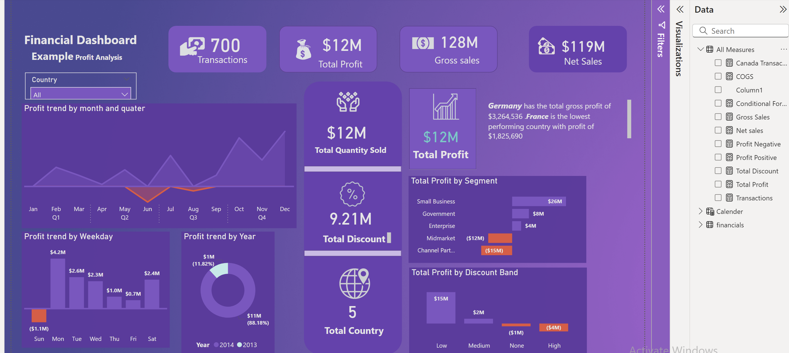

# Financial Dashboard

This repository contains a **Financial Dashboard** designed for profit analysis, showcasing key metrics, trends, and insights into business performance. The dashboard is built to aid decision-making by presenting financial data in a clear, interactive format.

---

## 📊 Key Insights from the Dashboard

### 1️⃣ **Overall Business Performance**
- **700 Transactions** were recorded, generating:
  - **$128M Gross Sales**
  - **$119M Net Sales**
  - **$12M Total Profit**

### 2️⃣ **Country-Specific Insights**
- **Germany** is the top-performing country with a total gross profit of **$3.26M**.
- **France** is the lowest-performing country, with a profit of **$1.83M**.

### 3️⃣ **Profit Trends**
#### By Time Period:
- **Monthly and Quarterly** profit trends highlight seasonal fluctuations in performance.
- Highest profits were observed in **Q4**, driven by end-of-year activities.

#### By Weekday:
- **Sunday** showed the largest loss at **($1.1M)**.
- **Monday** performed best with a profit of **$4.2M**, indicating strong start-of-week sales.

#### By Year:
- **2014** contributed **88.18%** of the total profit, amounting to **$11M**, while **2013** accounted for the remaining **11.82%** (**$1M**).

### 4️⃣ **Profit Segmentation**
- **Small Businesses** dominate with a profit of **$26M**.
- **Government** and **Enterprise** segments contributed **$8M** and **$4M**, respectively.
- Losses were seen in the **Midmarket** (**$12M**) and **Channel Partners** (**$15M**) segments.

### 5️⃣ **Discount Band Analysis**
- Profits were maximized in the **Low Discount Band** (**$15M**).
- Losses occurred in **Medium** (**$1M**) and **High Discount Bands** (**$4M**).

### 6️⃣ **Key Metrics**
- **Total Quantity Sold**: **$12M**
- **Total Discount**: **9.21M**
- **Countries Analyzed**: **5**

---

## 🚀 Features of the Dashboard
- **Interactive Visualizations**: Includes bar charts, line graphs, and pie charts to explore data across dimensions.
- **Filters**: Allows filtering by country to drill down into region-specific data.
- **KPI Cards**: Display key performance metrics for quick insights.

---

## 🛠 Tools and Technologies
- **Power BI**: For building and hosting the dashboard.
- **Data Source**: Financial data covering sales, discounts, profits, and transactions.

---

## 🧠 Use Cases
- **Business Analysts**: Track profitability trends and segment-wise performance.
- **Management**: Make data-driven decisions based on sales, profit, and discount effectiveness.
- **Finance Teams**: Identify high-performing regions and cost optimization opportunities.

---

## 📷 Dashboard Screenshots
### Overview

---

## 🤝 Contributing
Contributions are welcome! Fork the repository, add your insights, and create a pull request.

---

### 📝 License
This project is licensed under the MIT License.

---
